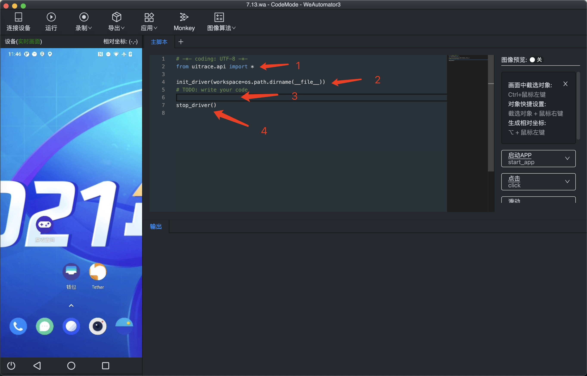
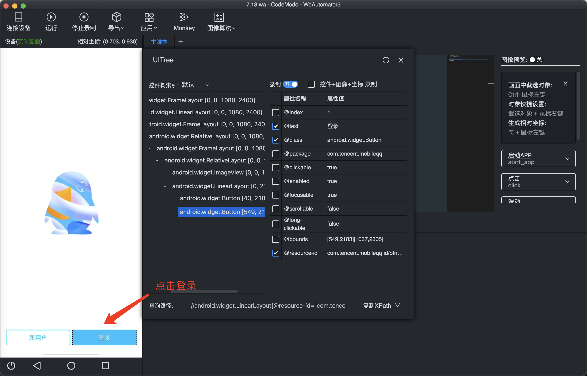

# 在WeAutomator IDE中编写脚本 
本文档将通过几个示例，来展示如何在IDE中编写python脚本。  
## 1. 准备工作  
首先用户需要仔细阅读[IDE的安装与启动](../install-and-start.md)、[连接Android设备](../../../quick-start/android-connect.md)、[连接iOS设备](../../../quick-start/ios-connect.md)，并且
对[IDE主交互界面](../IDE-interface.md)有一定的了解，同时在自己电脑上完成IDE的安装、工程建立、设备连接。接下来的内容将通过几个小示例来加深用户对IDE的了解，帮助用户编写基础的脚本。  

## 2. 示例  
我们打开IDE，选择代码模式并建立了自己的工程，然后通过IDE的连接设备功能，建立IDE和手机的联系，可以看到这时的初始界面如下： 
  
我们将在**主脚本**中编写脚本。
- 编号1：主脚本中默认导入WeAutomator的uitrace库，用户也可以导入其他库
- 编号2：初始化设备驱动和环境
- 编号3：用户代码编写区
- 编号4：结束驱动并生成报告

### 1）示例1: 登录qq  
本示例将展示如何使用IDE完成编写登录QQ的脚本。  
- 启动QQ  
在IDE中打开手机上的软件QQ后，使用IDE中的**启动APP**，从跳出的会话框中点击**从当前屏幕获取**，最后点击**确定**，IDE即可在主脚本的用户代码编写区生成相应的代码。 
  
接着我们可以在主脚本界面中看到，IDE生成了启动QQ的指令。 
 

- 点击登录  
接着点击**登录**按钮。这里需要说明的是，IDE提供了多种方式的点击操作，包括基于图像匹配的点击、基于位置坐标的点击、基于Xpath的点击等等，详情可通过[API文档](../../api.md)查看`click()`方法获知（同样启动QQ也存在多种方式，但是使用`start_app(pkg)`的方式最为稳定）。  
由于首次使用点击操作，我们将使用IDE中所有不同的点击操作来完成点击**登录**按钮的任务，用户可根据自身喜好，并结合具体场景选择合适的点击方式。  
基于UI控件的点击：用户需要选择顶部功能栏的**录制**->**控件录制**->**原生**，等待片刻后，会跳出以下画面。 （注：如果勾选**控件+图像+坐标**，IDE将在基于控件、基于图像和基于坐标的点击操作中选择最为合适的一种，这里我们为了展示基于控件的点击操作，故没有勾选，用户可根据自身选择是否勾选）。
 
我们点击**登录**后，这时的IDE界面如下。主脚本区域已经生成基于UI控件的点击代码。
  
基于位置的点击：用户可直接将鼠标移动到**登录**按钮处，Mac下使用快捷键**⌥**+鼠标左键（Windows下使用Alt+鼠标左键），即可在主脚本区生成基于位置的点击代码。 
 
基于图像的点击：和基于位置的点击一样，建议用户使用快捷键操作，Mac和Windows下均使用Ctrl+鼠标左键截取目标区域图像，然后点击截取的图像，便可在主脚本对应区域生成代码。 
基于文本的点击：用户需要在右部功能栏选择**点击**->**点击文字**， IDE便会生成相应代码，**用户需要自己输入要点击的文本信息**。 
  
本示例使用基于图像的点击操作。 
- 输入账号信息 
点击**登录**后，进入到输入账号和密码的界面。 输入账号和输入密码的操作类似，先点击账号输入框/密码输入框，再输入
账号/密码，其中点击操作不在赘述，本示例使用基于UI控件的点击方式。 
 
完成后，IDE界面如下。 
 
注：可以看到这时手机的账号和密码框并没有将账号信息输入，用户可以手动输入，
也可以注释掉主脚本第6和第7行，然后点击顶部功能栏的**运行**，完成账号密码的填入。 

- 完成登录  
完成登录前还需要点击授权和点击登录，用户可根据自行选择点击方式。本示例采用基于控件的方式点击授权，基于图像的方式点击登录。 

用户可以退出QQ，再在IDE中运行脚本，查看是否能完成QQ登录。  

### 2）示例2: 设置系统输入法  
本示例将展示如何使用IDE完成编写设置系统输入法的脚本。 
- 打开手机设置  
和启动QQ一样，也是先打开手机的设置，进入设置界面后，点击右部功能栏，点击**启动APP**，
在跳出的会话框中点击**从当前屏幕获取**，最后点**确定**，完成启动设置的代码生成。 
- 找到相应设置入口  
在本示例中，设置系统输入法，需要在设置界面依次点击**系统**->**语言和输入法**->**输入法**，进入输入法选择界面，最后选择相应的输入法。需要注意的是，在打开设置的初始界面，并没有**系统**字样。  
为了完成从初始设置界面点击**系统**，我们除了可以采用基于控件的点击操作外，还可以先进行滑动操作，直到手机界面出现**系统**选项，然后在选择相应的方法点击。  
  
我们点击右部功能栏的**滑动**，IDE将默认生成基于位置的滑动代码，并且没有设置滑动的起始点和终点的坐标。  
  
在这里需要说明的是，WeAutomator的`slide()`函数支持多种滑动方式，我们可以更改生成的`slide()`方法的参数by（对应的loc_from和loc_to也要更改，具体可参看[API文档](../../api.md)  ）。
本示例选择基于位置坐标的滑动方法，在选择滑动的起始坐标和终点坐标时，我们可以将鼠标移到手机界面，使用快捷键（Mac下为⌥+鼠标左键，Windows下为Alt+鼠标左键）生成对应`click()`函数，这时
`click()`函数中包含刚刚点击的位置的坐标信息，我们将坐标拷贝出来，并复制到`slide()`函数的起点/终点参数中（完成复制后记得删除`click()`函数），从而实现滑动操作。  
  
当然，以上只是说明了如何获得滑动的坐标信息，真正要实现滑动，我们还要设计类似以下的逻辑，实现多次滑动，直到找到**系统**选项。 
  
在这里我们使用`find()`函数去寻找当前界面上是否存在目标图像位置（这里就是**系统**字样的截图），并且我们修改了
`find()`方法中的timeout参数，让等待的时间缩短。该逻辑将一直滑动手机界面，直到出现**系统**字样。 
- 完成系统输入法设置 
后续点击相关按钮，用户可以选择相应的点击操作，完成系统输入法的设置。   

用户可以还原设置并退出到手机桌面，点击顶部功能栏的**运行**按钮，验证脚本能否正常执行。  

