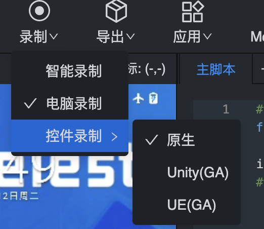
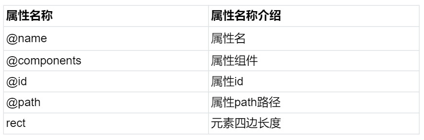

# WeAutomator IDE的界面介绍
## 1. WeAutomator IDE主界面介绍

WeAutomator IDE的主交互界面由5个部分组成：顶部功能栏、设备交互界面、脚本编辑栏、右部功能栏和输出栏。在本文档中我们默认已经连接移动Android设备，具体如何连接设备，请参考[连接Android设备](../../quick-start/android-connect.md)和[连接iOS设备](../../quick-start/ios-connect.md)  

## 2. 顶部功能栏
### 1）连接设备
**连接设备**主要负责IDE和移动设备连接，用户需要先将测试的移动端设备和电脑连接，在通过**连接设备**完成移动设备与IDE的连接。  
具体的连接方式参看[连接Android设备](../../quick-start/android-connect.md)和[连接iOS设备](../../quick-start/ios-connect.md)  
### 2）运行
**运行**负责运行当前编写的**主脚本**。用户在**主脚本**编写相关的测试代码后，可以通过点击顶部功能栏中的**运行**，运行脚本。脚本运行过程中，**运行**会变为**停止运行**，你可以通过点击**停止运行**，中断脚本运行。

### 3）录制
**录制**功能提供了方便的脚本编写的录制功能，可以用来记录使用者的相关操作，并实时生成对应的代码，降低了自动化测试的代码能力门槛，提高了自动化测试脚本编写的效率。  
WeAutomator IDE提供了三种录制方式，分别是**智能录制**、**电脑录制**和**控件录制**，其中**控件录制**包含**原生**、**Unity(GA)** 和 **UE(GA)** 三种控件录制方式。  

- **智能录制**
**智能录制**功能会根据用户当前操作，智能生成相应代码。例如，用户打开**智能录制**，点击手机上的应用，**智能录制**会自动在主脚本区域生成点击应用的代码。  
  
完成智能录制后，我们可以退回到初始界面，运行生成的脚本，看看运行情况是否和录制情况一致。
  
**智能录制**的功能远不止录制生成点击应用这么简单，它可以记录下用户在手机界面操作的位置信息，并通过调用`click()`和`slide()`等函数还原用户的所有操作操作。使用者可以根据自身需求，使用**智能录制**功能，大大简化代码编写难度。
- **电脑录制**
**电脑录制**会记录用户点击的位置信息，并生成相应的位置点击代码`click(pos, by=DriverType.POS, duration=0.05)`，并且在两次点击之间，**电脑录制**还会记录两次操作的时间间隔，并生成`time.sleep()`函数，还原用户两次点击的间隔。  

- **控件录制**
**控件录制**功能是通过记录用户点击的控件信息，生成相应代码还原用户操作。**控件录制**分为**原生**、**Unity(GA)**和**UE(GA)**三种方式，这里以Android设备为例。    
    **原生**控件录制主要针对于APP进行操作，获取各种软件上的元素列表，点击控件。打开**原生**控件录制即可获得以下页面。

    - 区域1为控件树，根据手机界面元素层级显示此树
    - 区域2为元素属性名和属性值
    
    - 区域3为控件查询路径，可根据此路径操作控件
    - 区域4为录制选项，勾选**控件+图像+坐标**可以同时进行这三种录制操作，在元素不稳定时就可以自动化切换至图像和坐标的操作，可以增加操作的鲁棒性。
    - 在手机交互界面操作控件后，手机界面会刷新，控件也会自动刷新，相关的操作代码会自动生成在代码区。用户可接着操作控件，直到完成整个脚本流程。  

    **Unity(GA)** 和 **UE(GA)**控件录制统称为**游戏控件录制**。游戏控件录制基于GAutomator框架，它支持Unity、UE游戏引擎控件的获取，需要游戏接入SDK使用。  
    GAutomator是一个针对手游的UI自动化测试开源框架，支持Unity、UE游戏引擎。设计理念与使用方式类似于Android的Uiautomator。GAutomator以引擎中的元素为操作对象（如Unity中的GameObject），通过操作GameObject实现UI自动化测试。基于GameObject的方式，不存在手机分辨率适配问题，一份脚本可以运行在不同的手机之上。基于GameObject的另外一个优点是鲁棒性较强，游戏的UI界面经常发生变化，GameObject变化频率相对较低。
    
    - GA控件是专门针对游戏做的获取控件的功能，根据游戏使用unity和ue引擎来选择
    - 区域1为控件树，根据手机界面元素层级显示此树
    - 区域2为元素属性名称和属性值
    
    - 区域3为控件查询路径，可根据此路径操作空间。
    - 区域4为录制选项，勾选**控件+图像+坐标**可以同时进行这三种录制操作，在元素不稳定时就可以自动切换至图像和坐标的操作来增加操作鲁棒性。
    - 操作控件后会自动刷新（在手机上直接操作控件不会自动刷新），如需要手动刷新，请点击关闭按钮旁边的刷新按钮。

### 4）导出  
**导出**功能是为了将当前工程存储为.zip格式，后续可使用导出的.zip工程上传终端云测。

### 5）应用  
**应用**中包含Android设备中的QQ/微信登录。用户可以使用**QQ登录**/**微信登录**快速登QQ/微信，也可以使用**用QQ登录**/**用微信登录**完成在其他应用使用QQ/微信账号登录。  

### 6）Monkey  
**Monkey**中集成了智能Monkey功能,用户可以调用`monkey()`方法完成相关测试。  
  

### 7）图像算法  
**图像算法**中集成了**边缘匹配**、**滑动验证**、**点特征匹配**和**黑白屏判断**。API使用方式参见[API文档](../api.md)
## 3. 设备交互界面
设备交互界面为使用者提供了查看和操作所连接设备的交互界面，配合IDE的其他功能，可以让使用者可视化自己的操作（获取控件树、显示点击位置、显示点击图标、显示截图等），方便使用者编写出高质量的测试脚本。  

- 区域1显示了当前鼠标停放在手机界面的位置
- 区域2显示了当前手机的屏幕
- 区域3包含手机的Power键、Home键、Back键和RecentApps键

## 4. 脚本编辑栏
如上文演示的那样，录制功能可以帮助我们在脚本编辑窗口自动生成测试脚本，用户也可以自己手动在脚本编辑窗内编写自动化脚本。

## 5. 右部功能栏
右部功能栏提供了一些快捷生成代码的按钮，可以帮助使用者完成常见的应用操作、点击操作、滑动操作、查找操作、输入文本操作、输入按钮操作、弹窗操作等。
- 应用操作  
将鼠标置于**启动APP**上，可以看到其包含以下几个功能。  
 
**启动App**：用户先打开想要测试的App，接着点击**启动App**，IDE会跳出以下界面。  
 
点击**从当前屏幕获取**，IDE便可获取当前手机界面打开的App，并自动填入**package**框中，接着点击**确定**，IDE将自动在代码区生成打开指定App的代码。  
点击**重装App**和**卸载App**，将在代码区生成 `restart_app(pkg)`和`uninstall_app(pkg)`函数，用户需要手动输入目标App名（可以通过**启动App**获取目标App的package name）。   
点击**安装App**，将跳出电脑的文件系统，用户可自己选择相应的安装包，进行App的安装。 

- 点击操作  
将鼠标置于**点击**上，可以看到其包含以下几个功能。  
   
点击**点击**，**设备交互界面**将进入`编辑中`，这时用户可以按住鼠标左键，截取想要点击的区域,松开鼠标左键，再鼠标左键点击目标区域，代码区将生成`click("obj_xxxxxxx.jpg", by=DriverType.CV, timeout=30)`,
实现按照图像匹配方式点击目标区域的操作。  
**双击**和**长按**的使用方式和**点击**方式一样，IDE将分别生成`double_click("obj_xxxxxx.jpg", by=DriverType.CV, timeout=30)`和`long_click("obj_xxxxxx.jpg", by=DriverType.CV, duration=1, timeout=30)`函数，来完成相应的操作。  
点击**点击文字**，IDE将直接在代码区生成`click(loc="", by=DriverType.OCR, offset=None, timeout=30, duration=0.05, times=1)`函数，用户可以手动输入点击目标区域的文本信息，完成OCR文字识别的点击操作。  
注：在脚本中可能会存在多次点击的情况，每次点击过后，手机屏幕都会跳转刷新，当使用基于OCR文字识别的点击操作时，可能在页面
刷新时识别出目标文字区域，这时页面尚未稳定，识别出的目标文字区域并不一定就是页面稳定后的目标区域，从而导致误点击。为了避免这种
设备跳转刷新带来影响，建议每次调用基于OCR文字识别的相关指令时，先使用`time.sleep(2)`，给页面2秒钟（根据情况设定时间）跳转刷新时间，
从而避免误操作（下面的例子中增加了等待时间，保证相关操作的正确）。  
使用**点击**功能编写脚本:  

运行脚本（这里在基于OCR文字识别的点击操作前增加了`time.sleep(2)`，以保证在手机界面稳定时，进行文字识别）

- 滑动操作  
点击**滑动**，IDE将自动生成基于位置的滑动函数`slide(loc_from=None, loc_to=None, loc_shift=None, by=DriverType.POS, timeout=30, duration=None)`，用户可配合使用
**右部功能框**中给出的快捷键，得到目标位置的坐标信息。

- 查找操作  
点击**查找**，IDE将自动在代码区生成基于CV的查找函数`find(loc by=DriverType.CV, timeout=30)`,用于获取目标图像区域的坐标。`find()`函数返回
目标区域的坐标信息，可以用来赋值。

- 输入文本操作  
**输入文本**用来一次性输入目标信息，避免频繁调用`click()`方法去点击手机键盘输入。   

- 输入按键  
**输入按键**可以快速生成点击手机常用按钮的代码，其中包含的常见按钮如下。  
  
用户可以选择点击的目标按键（如Home键），IDE将在代码区自动生成`press(DeviceButton.HOME)`。  

- 弹窗处理操作  
**弹窗处理**用来处理系统弹窗（不支持应用内弹窗），该功能包括`启用预设弹窗自动处理`(对应`start_event_handler()`)、
`添加事件自动处理规则'(对应`add_event_handler()`)、`清除事件自动处理规则`(对应`clear_event_handler()`)、
`事件自动处理立即生效`(对应`sync_event_handler()`)。请参考[API文档](../api.md)，获取相关api使用方法。  

## 6. 输出栏  
**输出栏**可以用来查看运行脚本的情况，还可以点击**查看报告**，跳转到脚本运行的报告页面  
  
脚本运行的报告页面  

