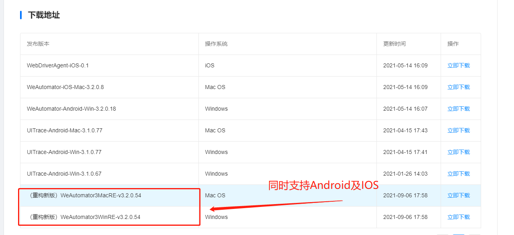

# WeAutomator IDE的安装和启动
WeAutomator IDE是一款移动端UI自动化工具，提供了简单易用的图像化界面，能够快速录制、生成自动化脚本。
WeAutomator IDE支持多种元素定位、录制方式：系统原生控件、Web控件、图像匹配、OCR文字识别、Unity游戏引擎、UE游戏引擎等。WeAutomator提供了Windows和Mac版的IDE工具，均支持Android、iOS设备。
## WeAutomator IDE的安装
- 外部客户：请联系商务获取安装包
- 内部客户：https://cloudtest.woa.com/console/store/tools/uitrace  
注：注意选择最新IDE版本

## WeAutomator IDE的启动
- 解压与打开  
将下载的安装包解压，双击WeAutomator3应用程序，即可打开WeAutomator IDE工具。  

- 初始化界面介绍    
  
打开后的IDE初始化界面中，主要分为**创建工程**、**更多信息**以及**打开文件夹**三个部分。用户可以从**更多信息**中获取IDE使用的在线文档，可以通过**创建工程**创建自己的工程，也可以通过**打开文件夹**中选择之前创建过的工程。  
注：在新版本的IDE的**创建工程**中，仅支持**代码模式**创建工程（老版本还包括**场景模式**）。  

- 创建工程  
    通过点击**代码模式**，用户可以开始创建自己的工程项目。  
      
    WeAutomator IDE的**代码模式**具有以下特点：  
    - 使用灵活、功能强大，支持录制生成和手动编写Python自动化脚本
    - 使用录制功能可自动生成操作脚本、支持快速生成操作代码、支持函数补全，极大地降低了使用门槛及代码能力要求
    - 支持unittest、pytest等用例管理方式 

    点击**代码模式**后，会跳出创建项目界面，用户可根据情况给项目命名，并选择存储位置。

    

    用户工程创建完毕，WeAutomator IDE完成启动,进入IDE界面。
    