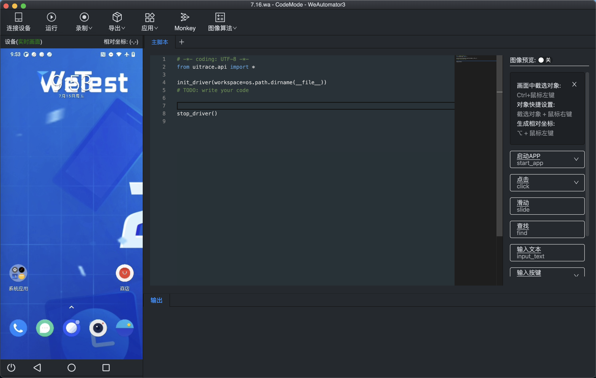

# 在WeAutomator IDE中用pytest组织测试用例  
在IDE中，不仅可以编写简单的脚本去操作手机，还可以编写用pytest组织的测试用例，用于后续提交到终端云测平台，使用云真机测试。  
## 1. pytest框架介绍  
pytest是一个非常成熟的全功能的Python测试框架，主要特点有以下几点：  
- 非常容易上手，入门简单，文档丰富。文档中有很多实例可以参考
- 能够支持简单的单元测试和复杂的功能测试
- 支持参数化
- 执行测试过程中可以将某些测试跳过，或者对某些预期失败的case标记成失败
- 支持重复执行失败的case
- 支持运行由nose，unittset编写的测试case 
- 具有很多第三方插件，并且可以自定义扩展

详细的pytest学习资料可以参考[Pytest使用手册](https://learning-pytest.readthedocs.io/zh/latest/index.html) 
### 1) 默认的用例识别规则  
- 用例文件：所有文件名为`test_`开头或者`_test`开头的文件会被识别为用例文件 
- 用例类：测试文件中每个`Test`开头的类就是一个测试用例类
- 测试用例：测试类中每个`test`开头的方法就是一条测试用例，测试文件中每个`test`开头的函数也是一条测试用例
- pytest兼容unittest，以unittest规范编写的用例，pytest也可以识别。 

通过上述的了解，可以知道pytest支持函数形式和类形式的测试用例。 现分别做简单介绍。 

### 2）函数形式编写用例  
测试文件中的测试函数需要以`test`开头，不正确的命名会导致无法测试。  
```python
# \pytest-cases\test_demo1.py
import pytest

def test_case1():
    assert 1 == 2

def test_case2():
    assert 1 == 1

if __name__ == '__main__':
    pytest.main(['-v'])
```

我们可以在编译器里面直接运行，或者在命令行里面调用pytest命令运行。  
示例里涉及断言`assert`语句，在pytest中，`assert`是编写测试的最基础工具。如:  
```python
assert a == b
assert a <= b
```
`assert`的具体语法可以参考[assert statement](https://docs.python.org/3/reference/simple_stmts.html?highlight=assert#grammar-token-assert_stmt)  
示例中还涉及pytest的运行参数`-v`，更多参数可以通过`pytest -h`查看，或者参考[pytest运行参数](https://www.jianshu.com/p/979d68aee236)  

### 3) 以类的形式编写用例  
测试文件中的测试类需要以`Test`开头，类中的测试用例需要以`test`开头  
```python
# \test-cases\test_demo2.py
class TestClass:
    def test_func1(self):
        assert 1 == 1
    def test_func2(self):
        assert 2 == 1
```

在编写pytest测试用例时，经常会使用pytest中的`setup`和`teardown`方法, 去做一些初始化和清除工作，如：
```python
class TestClass:
    def setup(self):
        print('setup: 测试用例开始执行')

    def teardown(self):
        print('teardown: 测试用例结束执行')
    
    def test_func1(self):
        print('test_func1开始测试')
        assert 1 == 1
    
    def test_func2(self):
        print('test_func2开始测试')
        assert 2 == 1
```
在命令行运行
```
pytest test_demo2.py -s
```
执行结果简略展示如下。
```
setup: 测试用例开始执行
test_func1开始测试
.teardown: 测试用例结束执行
setup: 测试用例开始执行
test_func2开始测试
Fteardown: 测试用例结束执行
```
在该种情况下，每次执行类中的测试用例，都会在测试用例执行前、执行后分别调用类中定义的`setup()`和`teardown()`方法。上面显示的结果中，在`teardown()`方法输出语句前出现的`.`和`F`，是由当前
测试用例执行成功和失败引起的。  

更多的详情可参考[pytest测试用例之setup与teardown方法(一)](https://cloud.tencent.com/developer/article/1657959?from=10680)、[pytest测试用例之setup与teardown方法(二)](https://cloud.tencent.com/developer/article/1658959?from=article.detail.1657959)   


## 2. IDE中使用pytest组织测试用例  
WeAutomator IDE支持在工程内使用pytest形式编写测试脚本。  
我们打开WeAutomator IDE，选择代码模式，建立工程，进入IDE界面后，连接手机，得到如下初始化界面，我们将在主脚本区域编写pytest形式的脚本。  
  
初始化的主脚本如下。
```python
# -*- coding: UTF-8 -*-
from uitrace.api import *

init_driver(workspace=os.path.dirname(__file__))
# TODO: write your code

stop_driver()
```

我们可以在初始化脚本的基础上组织测试用例，IDE中使用pytest组织测试用例通常采用以下模式。
```python
# -*- coding: UTF-8 -*-
from uitrace.api import *
import pytest

# TODO: write your code
class TestClass:
    def setup_class(slef):
        '''
        在测试类执行之前执行一次
        '''
        # 初始化设备驱动和环境
        init_driver(workspace=os.path.dirname(__file__))

        # 预先处理系统弹窗
        start_event_handler()

        # 按下Home键，让手机测试前的初始化界面为Home页面
        press(DeviceButton.HOME)

    def teardown_class(self):
        '''
        在测试类运行结束后运行
        '''
        # 退回到手机的Home页面
        press(DeviceButton.HOME)

        # 释放驱动，生成报告
        stop_driver()

    def setup_method(self):
        '''
        类中每个测试用例开始前执行
        '''
        pass
    
    def teardown_method(self):
        '''
        类中每个测试用例结束后执行
        '''
        pass
    
    def test_case1(self):
        '''
        测试用例1
        '''
        pass
    
    def test_case2(self):
        '''
        测试用例2
        '''
        pass


pytest_main([os.path.join(os.path.dirname(__file__), "main.py")])
```
我们需要导入pytest第三方库，在编写脚本过程中可以充分利用IDE提供的功能，实现快速编写脚本。  
我们使用pytest组织测试类的时候，如上面的`TestClass`测试类，可以使用`setup_class()`方法进行测试类的初始化，包括初始化设备、处理系统弹窗等，使用`teardown_class()`方法
进行释放资源等操作。`setup_class()`方法会在每个测试类运行前执行一次，`teardown_class()`方法会在每个测试类结束运行后执行。运用好这两个方法可以帮助我们做好测试的初始化和清理工作。
示例中同样使用了`setup_method()`和`teardown_method()`方法，`setup_method()`方法会在执行类中每个测试用例之前执行一次，可以在每个测试用例运行前进行统一的操作，包括跳回到统一页面、
记录运行测试用例前的数据等等，`teardown_method()`方法会在测试类中每个测试用例结束后执行一次，可以在每个测试用例运行后进行统一操作，包括清理空间，记录数据，显示报告等。合理使用以上方法，
可以让我们写出逻辑清楚，结构明朗的测试用例。  

接下来我们将通过示例来展示如何在IDE中使用pytest框架组织测试用例。  

### 示例1 


