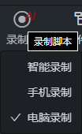
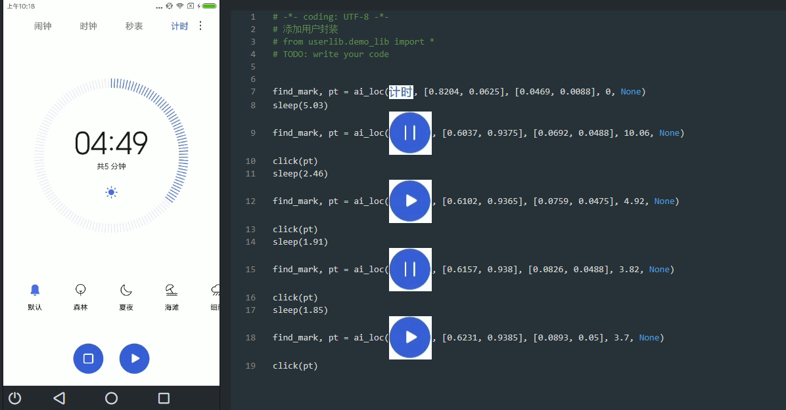
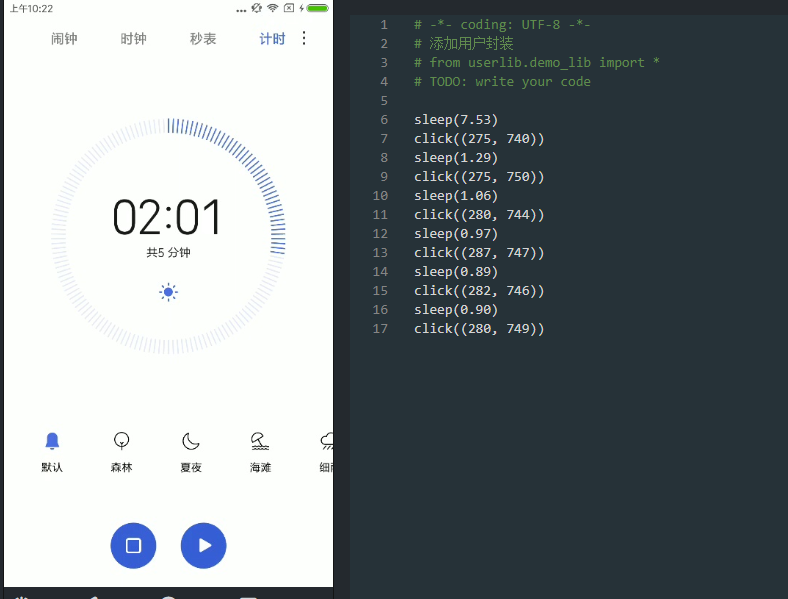
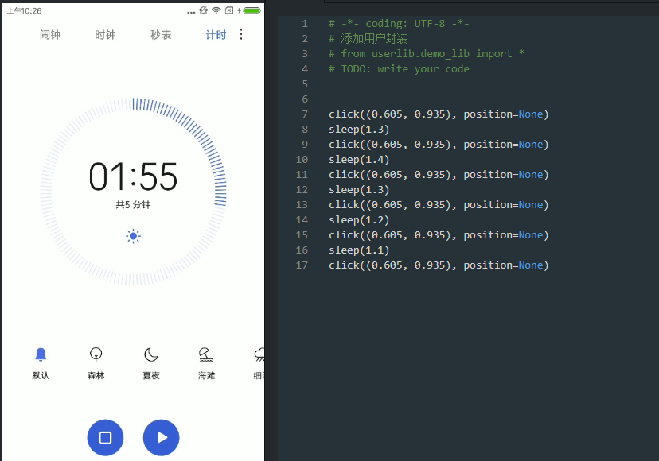

# 坐标录制

本工具中包含三个录制功能：智能录制、手机录制、电脑录制。

- 智能录制：录制手机上的操作，以图像展示。
- 手机录制：录制手机上的操作，以坐标展示。
- 电脑录制：录制电脑上的操作，以坐标展示。

## 使用方法

连接设备后，将鼠标移至录制按钮，选择录制模式，然后点击录制，控制手机或者电脑进行录制。

## 生成代码样式

## 智能录制

智能录制根据第一次点的位置进行图片识别

### 手机录制

记录手机点击的坐标

### 电脑录屏

记录电脑投屏上的点击坐标

