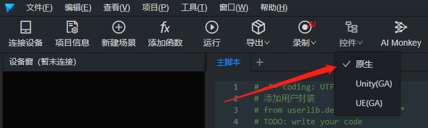
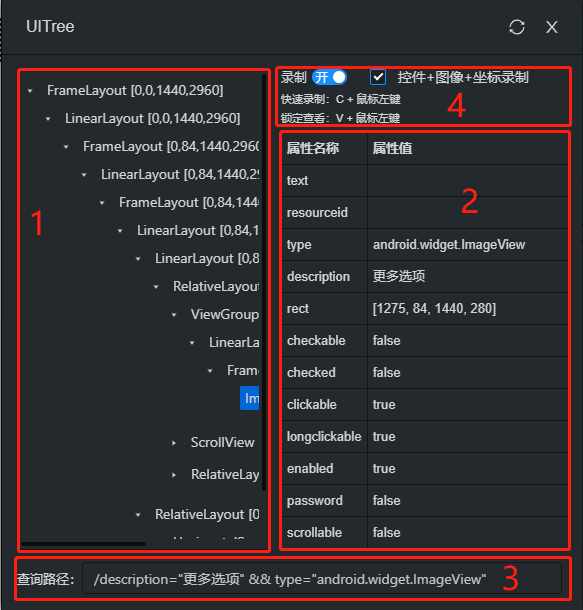
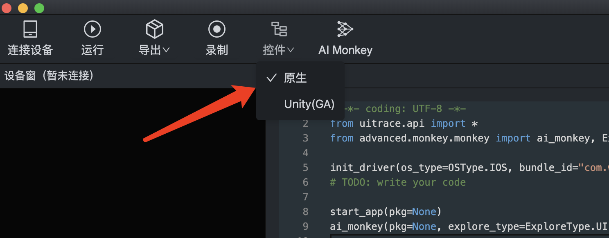
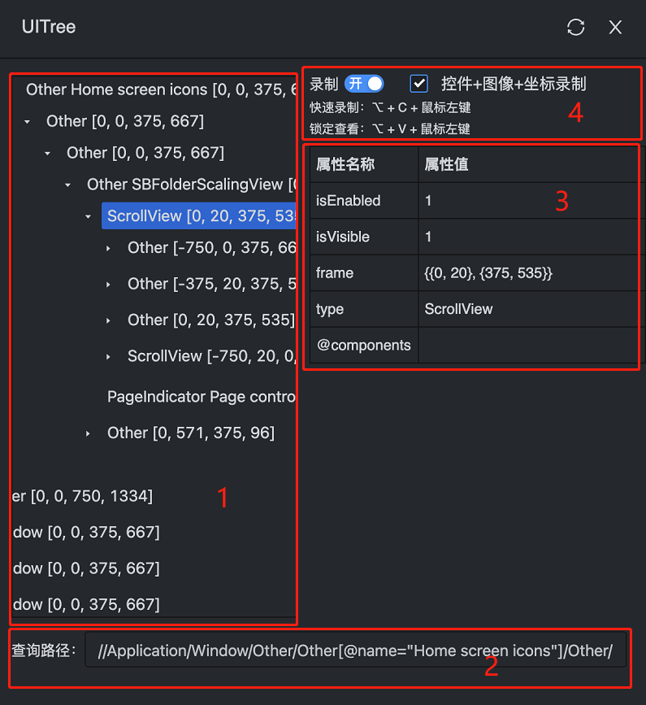

# 原生控件录制

原生控件主要针对于 APP 进行操作，获取各种软件上的元素列表，点击控件，选择原生控件即可获取以下页面

## Android 控件

  

- 红框 1 为控件树，根据手机界面元素层级显示此树
- 红框 2 为元素属性名称和属性值

  | 属性名称      | 属性名称介绍   |
  | ------------- | -------------- |
  | text          | 元素文本信息   |
  | resourceid    | 资源 id        |
  | type          | 元素类型       |
  | description   | 元素描述信息   |
  | rect          | 元素四边长度   |
  | checkable     | 是否可勾选     |
  | checked       | 勾选状态       |
  | clickable     | 元素是否可点击 |
  | longclickable | 长按操作       |
  | enabled       | 元素是否启用   |
  | password      | 是否以密文显示 |
  | scrollable    | 元素是否可滚动 |

- 红框 3 为控件查询路径，可根据此路径操作控件，按 v+鼠标左键可以锁定查看
- 红框 4 为录制选项，勾选 **控件**+**图像**+**坐标录制**可以同时进行这三种录制操作，在元素不稳定时就可以自动切换至图像和坐标的操作增加鲁棒性，录制快捷键为 **C+鼠标左键**

操作后控件会自动刷新（如在手机上直接操作控件不会自动刷新），如需要手动刷新请点击**关闭按钮**旁的刷新按钮。

## iOS 控件

- 红框 1 为控件树，根据手机界面元素层级显示此树
- 红框 2 为元素属性名称和属性值
  属性名称 | 属性名称介绍
  -----|-------
  @components | 组件
  frame | 四边长度
  isEnabled | 是否可用
  isVisible | 是否可见
  type | 类型| 组件

- 红框 3 为控件查询路径，可根据此路径操作控件，按**option+v+鼠标左键**可以锁定查看
- 红框 4 为录制选项，勾选**控件**+**图像**+**坐标录制**可以同时进行这三种录制操作，在元素不稳定时就可以自动切换至图像和坐标的操作增加鲁棒性，录制快捷键为**option+C+鼠标左键**

操作后控件会自动刷新（如在手机上直接操作控件不会自动刷新），如需要手动刷新请点击关闭按钮旁的刷新按钮
