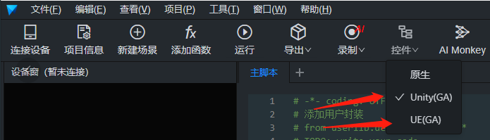
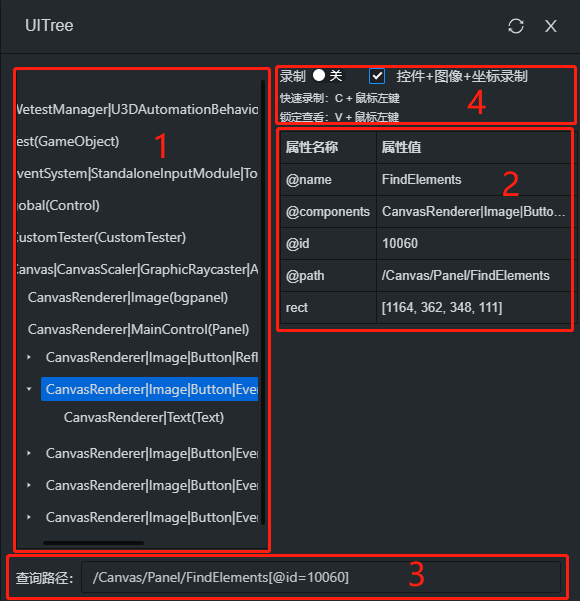

# 游戏控件录制

工具基于 GAutomator 框架支持 Unity、UE 游戏引擎控件的获取，需要游戏接入 SDK 使用[接入指引](https://github.com/Tencent/GAutomator/tree/master/GAutomatorSdk/docs)。

> GAutomator 是一个针对手游的 UI 自动化测试开源框架，支持 Unity、UE 游戏引擎。设计理念与使用方式，类似于 Android 的 UIAutomator。GAutomator 以引擎中的元素为操作对象（如 Unity 中的 GameObject），通过操作 GameObject 实现 UI 自动化测试。基于 GameObject 的方式，不存在手机分辨率适配的问题，一份脚本能够运行在不同手机之上。基于 GameObject 的另外一个优点为鲁棒性较强，游戏的 UI 界面经常发生变化，GameObject 变化频率相对较低。

## 功能使用

- GA 控件是专门针对游戏做的获取控件的功能，根据游戏使用 unity 和 ue 引擎来选择
- 红框 1 为控件树，根据手机界面元素层级显示此树
- 红框 2 为元素属性名称和属性值

  | 属性名称    | 属性名称介绍   |
  | ----------- | -------------- |
  | @name       | 属性名         |
  | @components | 属性组件       |
  | @id         | 属性 id        |
  | @path       | 属性 path 路径 |
  | rect        | 元素四边长度   |

- 红框 3 为控件查询路径，可根据此路径操作控件，按 v+鼠标左键可以锁定查看
- 红框 4 为录制选项，勾选控件+图像+坐标录制可以同时进行这三种录制操作，在元素不稳定时就可以自动切换至图像和坐标的操作增加鲁棒性，录制快捷键为 c+鼠标左键

操作后控件会自动刷新（如在手机上直接操作控件不会自动刷新），如需要手动刷新请点击关闭按钮旁的刷新按钮。
