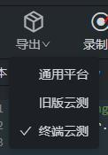

# 提交到 WeTest 云测

- 公司外用户：https://wetest.qq.com/n/console/testlab-function/auto-compatible/test
- 公司内用户：https://cloudtest.woa.com/console/testlab/compatible/test/



请使用工具中导出-终端云测，直接导出脚本并上传到平台使用。

## 功能测试

强烈建议使用代码模式开发脚本：由于终端云测 **功能测试** 需要以`pytest`的`unittest`形式解析并执行用例，目前仅**代码模式**很好的支持在工程内以`pytest`的`unittest`形式编写脚本。

实例工程：[function_demo.zip](https://ct-1251501889.cos.ap-guangzhou.myqcloud.com/update/weautomator/function_demo.zip?q-sign-algorithm=sha1&q-ak=AKIDINDrGPWub6TcWAdgYDdm46sOeeOvPNFS&q-sign-time=1646374519;1740982519&q-key-time=1646374519;1740982519&q-header-list=&q-url-param-list=&q-signature=635be1bfbf787432fe1ae668488781556717b580)

编写示例：

工程目录如下，重点关注`test_simple.py`及`main.py`：

        .
        ├── log
        ├── monitor
        ├── pic
        ├── trace
        ├── userlib
        │   └── test_simple.py
        ├── main.py
        ├── script.ini
        └── data.json

```python
# -*- coding: UTF-8 -*-
# script.py

import pytest

# pytest原生main运行
pytest.main()
pytest.main([os.path.join(os.path.dirname(__file__), "userlib", "test_simple.py::test_2")])

# API运行，本地执行时会运行传入的用例，在终端云测的功能测试运行时，会执行功能测试中选择的用例
print('pytest用例: 运行test_simple.py中所有用例')
pytest_main([os.path.join(os.path.dirname(__file__), "userlib", "test_simple.py")])
print('pytest用例: 运行test_simple.py中的用例test_2')
pytest_main([os.path.join(os.path.dirname(__file__), "userlib", "test_simple.py::test_2")])
```

```python
# -*- coding: UTF-8 -*-
# test_simple.py

import pytest
# 提交pytest功能测试必须用try-except
try:
    # 新版本WeAutomator使用(含IOS)
    from uitrace.api import *
    # 老版本WeAutomator使用(仅Android)
    from runner.api import *
except:
    print("cannot import module runner")

@pytest.fixture(scope='function')
def test_1():
    print("test_1")

def test_2():
    print("test_2")


```

## 兼容适配

场景模式、代码模式皆支持，正常导出提交即可。

## 其他云测平台

请使用工具的 **导出**-**通用平台**，直接导出脚本，并上传到其他云测平台使用。
