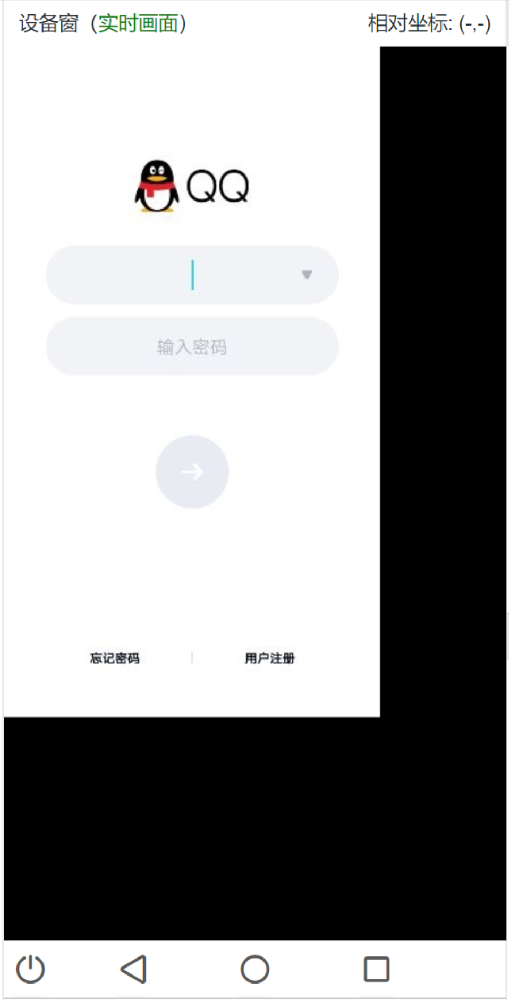
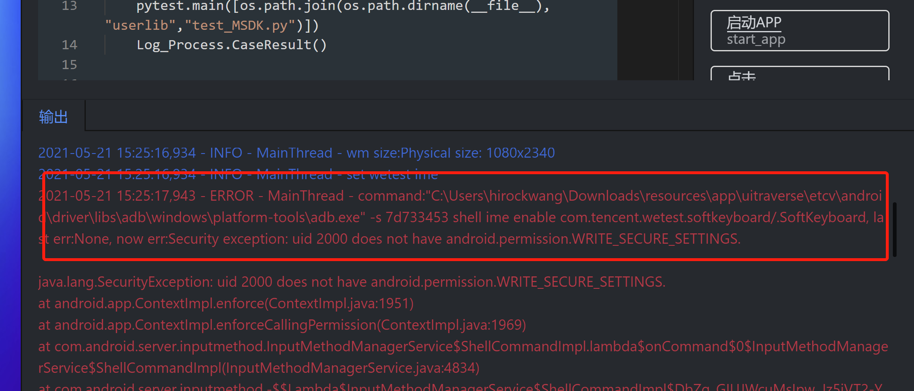
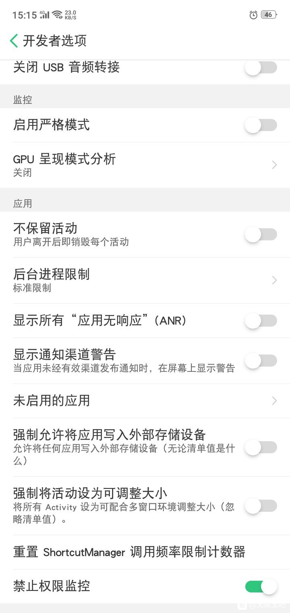
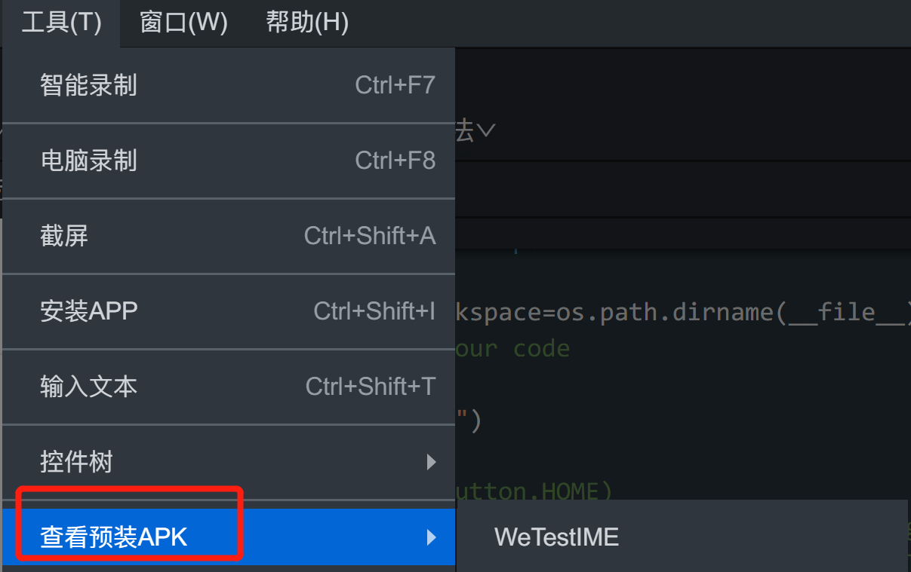

# Android设备

## 设备连接类

### 工具中手机屏幕显示有较大黑边，不能填满整个区域（如图所示）

请在手机“设置”-“显示”-“屏幕分辨率”中调为“WQHD”或最大分辨率。

### MIUI 10+等部分手机无法连接

请选择 WeTest Java 连接方式，分辨率设置为较低的数值，如 720、640（分辨率较高会导致画面卡顿设置连接失败）

### 执行脚本时报 uid 2000 does not have android. permission. WRITE SECURE SETTING

打开开发者模式禁止权限监控

  

## 设备操作类

### 部分手机无法通过工具操控手机

设置->开发者选项->打开安全设置（允许通过 USB 调试修改权限或模拟点击），部分手机需要插入 sim 卡后打开 usb 传输

### 其他错误

- **（查看->工具日志）cloudscreen run over, return value:255**
  请选择 WeTest Java 连接方式，分辨率设置为较低的数值，如 720、640（分辨率较高会导致画面卡顿设置连接失败）

- **（查看->工具日志）Failed to load dynlib/dll '\*.dll'. Most probably this dynlib/dll was not found when the application was frozen.**
  打开关于->环境检测，查看各项是否已安装
  尝试以管理员权限运行（部分电脑普通用户权限较低，无法访问所需资源）

- **（运行输出）设备默认屏幕分辨率被修改，请复查**
  部分手机不是默认分辨率，使用`adb shell wm size`查看输出中的`Physical size`表示设备默认分辨率
  如果输出 Override size 则表示默认分辨率被修改
  可用`adb shell wm size 1440x2960`重置（`1440x2960`为 Physical size）

- **Android 原生控件录制无法打开**
  检查手机是否已安装 WeAutomator 应用
  应用路径为程序根目录下：菜单栏->工具->查看预装 APK->AtServer

- **脚本中使用 inputChineseText 输入中文时无效或出现乱码**
  检查 WeTest 输入法是否安装并启用
  Wetest 输入法路径为程序根目录下：菜单栏->工具->查看预装 APK->WeTestIME

- **脚本中使用 input_text 输入无效**
  检查 WeTest 输入法是否安装并启用
  Wetest 输入法路径为程序根目录下：菜单栏->工具->查看预装 APK->WeTestIME
  

- **使用 ai_monkey 后导航栏被隐藏**
  执行 `adb shell settings put global policy_control null`

- **自动弹出开关控制设置指南**
  执行 `adb shell settings put secure enabled_accessibility_services 0`

- **使用工具自带 QQ/微信快捷登录，出现无法输入的情况**
  确保手机安全键盘关闭

- **执行 adb 命令出现 java.lang.SecurityException: Permission denial**
  方法一：在开发者选项里，打开“USB 调试（安全设置）”选项，允许 USB 调试修改权限或模拟点击
  方法二：在开发者选项里，打开“禁止权限监控”选项
