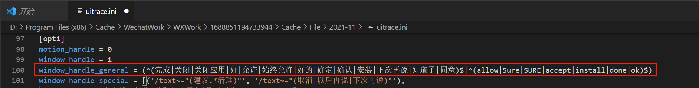

# iOS设备

## iOS 设备无法连接

- 情况一：确定配置了 bundleid 值，并且与手机上 wda 的 bundleid 值相同。
- 情况二：确定防火墙设置为关闭状态，如状态为开启，需改为关闭状态。
- 情况三：查看是否打开了代理，需关闭代理模式。

  1. 打开 mac 电脑终端，在终端输入以下命令并按回车键。

  ```
  export http_proxy=""                    
  export https_proxy=""
  export HTTP_PROXY=""
  export HTTPS_PROXY=""
  ```

  2. 输入 open ，然后将软件拖进终端，然后点击回车等待软件打开

- 情况四：确定手机上的 wda 程序是否正常运行，打开 WebDriverAgent，如果出现黑屏画面然后快速回到桌面表示正常。
  如果 wda 程序正常运行还是无法连接，工具内菜单栏->窗口->终端，打开终端，然后执行命令(bundleid 替换为手机对应的值)
  `shell $ tidevice wdaproxy -B com.watest.WebDriverAgentRunner.xctrunner --port 8200`

      然后浏览器访问 http://127.0.0.1:8200/status 查看是否有json格式数据返回，如果访问异常，检查终端窗口是否有异常信息

## 无法输入文字

部分控件无法输入文字或输入文字时出现手机断开连接情况。尝试修改输入文字 api 的参数值，如下所示

```
input_text("1234", xpath='//Application[@name="微信"]', timeout=30, depth=10)
```

参数解释：

- xpath 默认为 None，尝试赋值为页面最顶层 xpath。可在控件录制页面右键复制 xpath
- depth 默认为 10，尝试增加 depth 进行输入，每次增加 1 来逐次测试

## 老版本工具部分界面自动点击取消

打开`菜单栏->查看->工具配置->uitrace.ini`，修改

```
window_handle_general = (^(完成|关闭|关闭应用|好|允许|始终允许|好的|确定|确认|安装|下次再说|知道了|同意)$|^(allow|Sure|SURE|accept|install|done|ok)$)
```



假如以上情况都已经设置好，但还是出现无法连接的环境，建议如下操作：

## 运行时脚本断开

- 情况一：如果是在应用切换或返回桌面在进行操作时断开的，建议在中间加上 sleep，让程序暂缓执行，wda 在切换后使用不太稳定
- 情况二：检查数据线是否完好，接口是否松动
