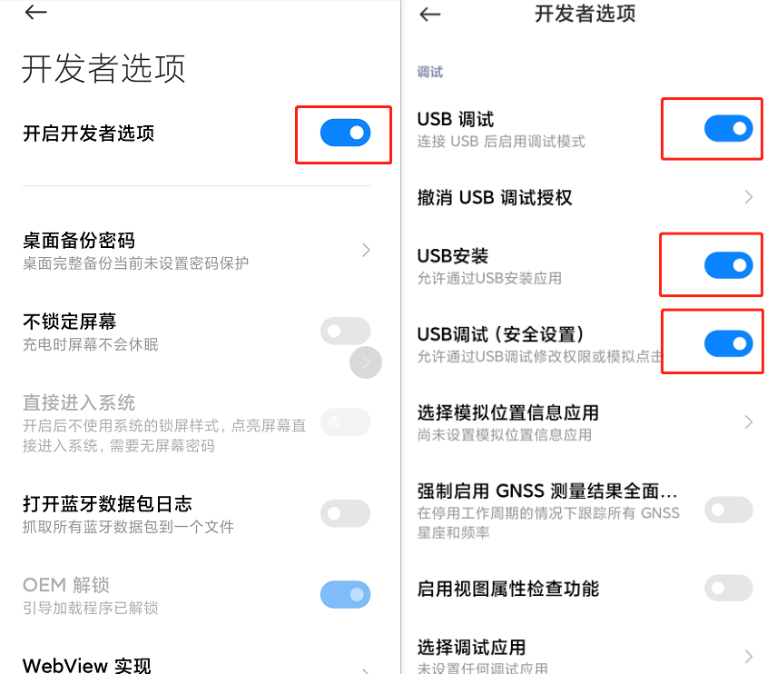
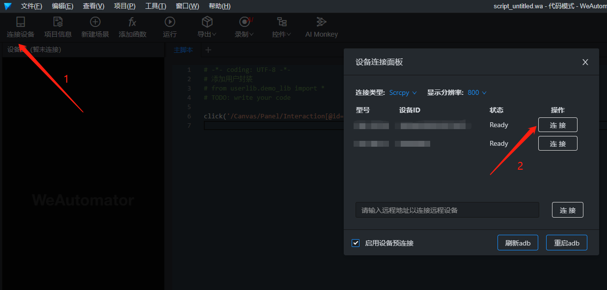
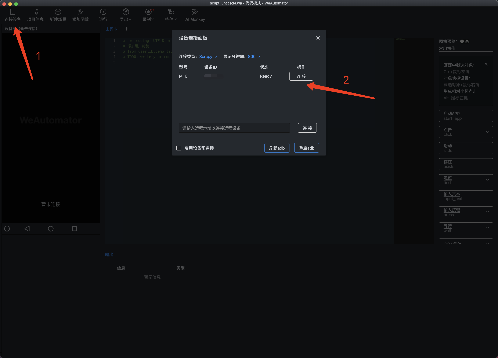

# 连接Android设备

<iframe frameborder="0" width="720" height="380"
    src="https://v.qq.com/txp/iframe/player.html?vid=o3248j3di26" allowFullScreen="true"></iframe>

## windows

1. USB 线连接安卓手机，打开 USB 调试：_设置-开发者选项-USB 调试_，参考[官方文档](https://developer.android.com/studio/debug/dev-options.html#debugging)；  
   
2. 工具点击 **连接设备**，建议使用默认 **Scrcpy** 连接方式，点击 **连接**。如设备系统版本 < Android 7，请使用 **WeTest Native** 方式连接。
   

## macOS

### 安装 adb

**手动安装**

从[Android 官方开发网站](https://developer.android.google.cn/studio/releases/platform-tools?hl=zh-cn) 下载最新版 platform-tools 包，解压缩后，将其路径并添加到系统`PATH`中。

**homebrew 安装**

1、安装 homebrew

```bash
$ ruby -e "$(curl -fsSL https://raw.githubusercontent.com/Homebrew/install/master/install)"
```

2、安装 adb

```bash
$ brew cask install android-platform-tools
```

完整完毕后，打开终端，执行以下命令测试 adb 是否正确配置成功。

```
$ adb devices
```

### 连接手机

adb 安装完毕后，将 Android 手机通过 USB 线与 mac 连接，此时手机上会弹出授权提示框，允许后，再次在终端执行 `adb devices` 命令应能识别到 Android 设备。
打开 WeAutomator，点击菜单栏 **连接设备**，建议使用默认 **Scrcpy** 连接方式，点击 **连接**。如设备系统版本 < Android 7，请使用 **WeTest Native** 方式连接。

