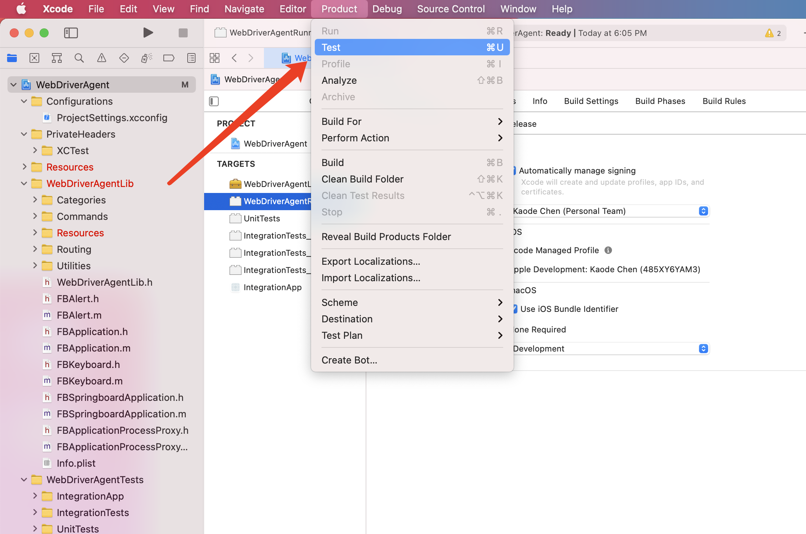
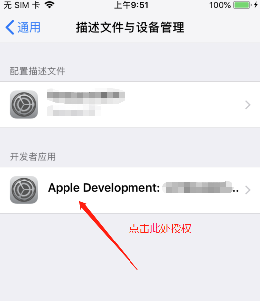
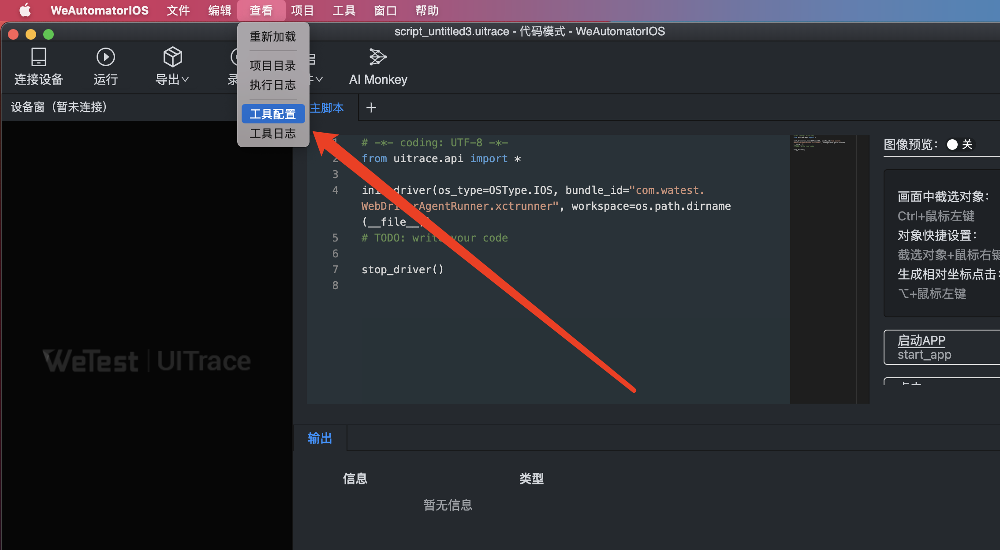

# 连接iOS设备

## macOS

最新版现已支持 Intel 版本和 M1 版本，macOS >= 11.15

<iframe frameborder="0" width="720" height="380"
src="https://v.qq.com/txp/iframe/player.html?vid=h3248apb3bq" allowFullScreen="true"></iframe>

### 手机安装 WDA（如已安装可跳过）

1.  **下载环境包**

从 GitHub 克隆`WebDriverAgent`项目，后面简称`WDA`。
```
git clone https://github.com/appium/WebDriverAgent.git
```

2.  设置 WebDriverAgent
   使用 Xcode 打开 WebDriverAgent
   - （1）修改 Product Bundle Identifier
   
   - （2）电脑连接真实手机后，选择设备
   
   - （3）更换 WebDriverAgentRunner 证书
   
   - （4）更换 WebDriverAgentLib 证书
   

3.  执行 WebDriverAgentRunner
   - （1）选择 Product -> Scheme -> WebDriverAgentRunner
   
   - （2）运行 Product -> Test
   
   - （3）test 后可能出现 could not launch，需要进行手机授权后再次 test
   
   

### 修改 WeAutomator 配置（如已修改可跳过）

（1）点击查看，选择工具配置



（2）填入脚本 bundle id


（3）双击 uitrace.json，填入修改 Product Bundle Identifier 的值


### 连接手机


## windows

1. 安装新版 iTunes，如果手机首次连接该电脑，建议打开 iTunes 确认手机可以成功连接。可从苹果官网下载对应版本的 iTunes 工具

   https://support.apple.com/en-us/HT210384

   

2. 手机安装`WebDriverAgent`程序（后简称 WDA），详见[macOS下iOS连接](#macos)
3. 点击终端输入 tidevice applist 查看 bundle id (init_driver 里面填入对应的 id）

   

4. 点击查看--工具配置--uitrace.json，填入对应的 bundle id

   

5. 连接手机

   
