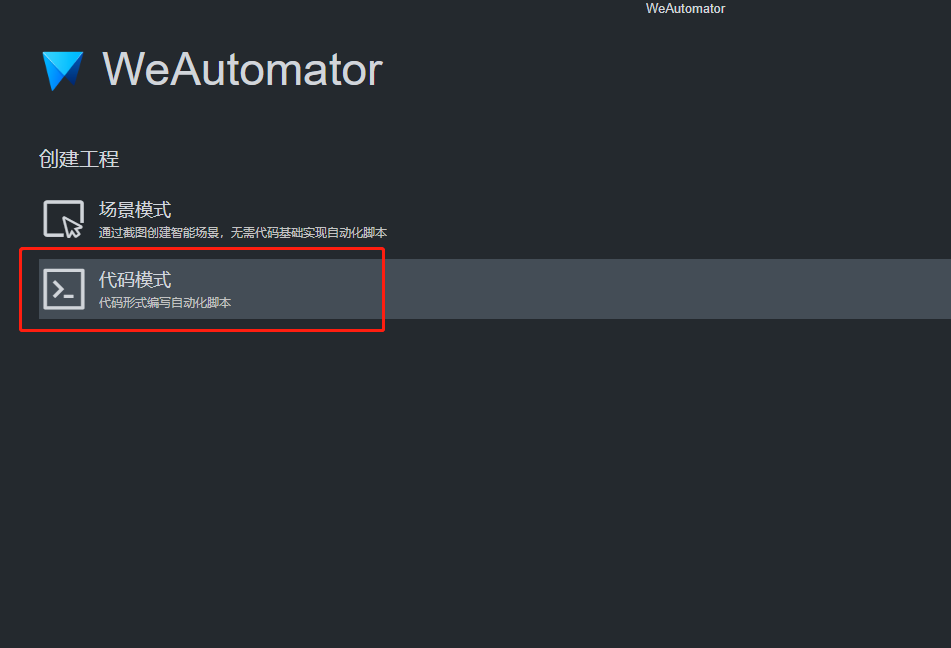
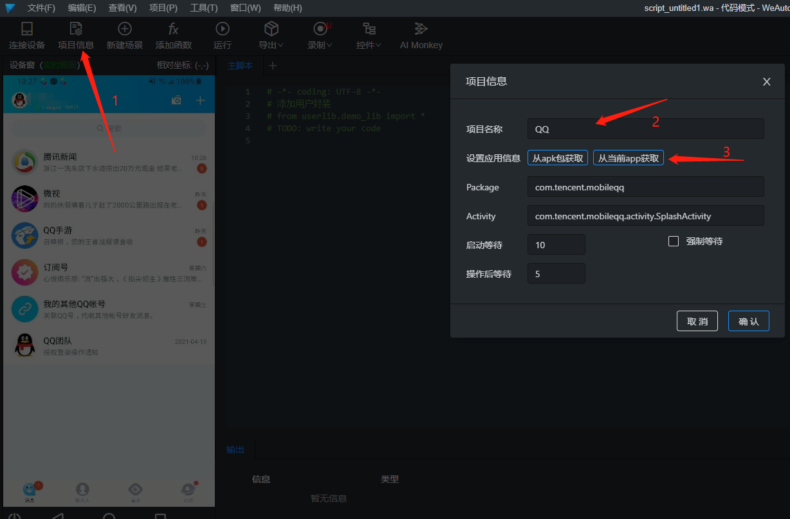
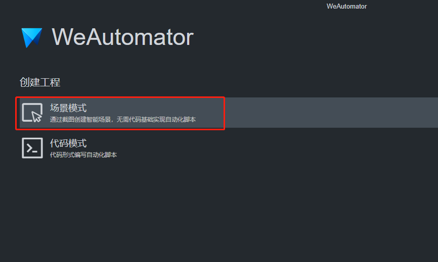

# 编写脚本

WeAutomator 支持两种模式：

- 代码模式
- 场景模式

下面分别介绍。

## 代码模式（推荐）

使用灵活、功能强大，可通过录制生成或手动编写 Python 自动化脚本。

- 支持 Android 和 iOS 设备
- 录制功能可利用鼠标点击/拖拽等快速生成操作代码，同时还编辑区支持内建函数自动补全，极大程度降低了使用门槛及代码能力要求。
- 支持 **unittest**、**pytest** 等用例管理方式；原生支持 Python 能力，灵活强大。

<iframe frameborder="0" width="720" height="380"
src="https://v.qq.com/txp/iframe/player.html?vid=d3248llyku8" allowFullScreen="true"></iframe>

1. 启动 WeAutomator 工具，点击 **代码模式**

2. 点击 项目信息，填写相关内容，其中 Package、Activity 信息，可通过点击 从 apk 包获取（从被测项目 apk 包获取）或 从当前 app 获取（从手机当前运行的被测 app 首页获取）自动填写。

3. 代码编写
   - 3.1. 基于图像匹配的编写
     - 3.1.1. 按住键盘 **Ctrl**，将鼠标移至左侧 **设备窗口** 手机画面上，按住 **鼠标左键** 可以截选图像区域；
     - 3.1.2. 在选定区域点击 **鼠标右键** 可以在列表中选择操作，如选择 **点击** ，在 **主脚本** 中会生成`click(***)`的点击代码，在执行脚本时如匹配到该截图，则会点击图像中心位置；
     - 3.1.3. 在 **主脚本** 右侧的 **常用操作** 栏中可以查看常用 API，点击可快速生成到对应脚本；全部 API 可以拉至最下面点击 **查看更多** 或在 **帮助-API** 中查看。
   - 3.2. 基于安卓控件的编写（游戏等非安卓控件的无法使用）
     - 3.2.1. 点击 **控件** ，在弹出窗口**UITree** 中可以看到当前手机画面的控件树，在 **设备窗** 手机画面区域进行鼠标操作，**主脚本** 中会自动生成基于控件的操作脚本；
     - 3.2.2. 工具也支持直接在 **主脚本** 中根据提供的 API 编写安卓控件的相关操作。
4. 执行
   4.1. 点击 **运行** 执行脚本，可在 **输出** 框内查看执行情况；或点击 **导出** 打包脚本，可上传到 WeTest 云真机平台执行脚本。

## 场景模式（仅支持 Android）

无需代码，仅通过截图和设置，即可快速实现简单的自动化脚本；支持将场景设置为随机，脚本遇到场景时会执行对应操作，未遇到时也不会阻塞主流程执行，轻松处理偶现情况；支持代码模式功能；

1. 启动 WeAutomator 工具，点击 **场景模式**

2. 点击 项目信息，填写相关内容，其中 Package、Activity 信息，可通过点击 从 apk 包获取（从被测项目 apk 包获取）或 从当前 app 获取（从手机当前运行的被测 app 首页获取）自动填写。

3. 创建脚本
   - 3.1. 创建智能场景
     - 3.1.1. 标识对象 - 3.1.1.1. 在测试画面，点击 **新建场景**，在 **设备窗口** 中截取图像，该图像默认作为场景的标识对象 （**对象详情-对象类型** 中可查看图像类型）。执行脚本时，根据此图判断设备是否运行到该场景，运行到则执行对应场景操作；
     - 3.1.2. 操作对象
       - 3.1.2.1. 再次在 **设备窗口** 中截取一张图像，该图像默认作为场景的操作对象（**对象详情-对象类型** 中可查看图像类型），可在 **对象详情-常用操作** 中选择执行的操作（支持自定义脚本），执行脚本时，如通过标识识别到该场景，会匹配场景中的操作图像，匹配到后会执行该操作图像上设置的操作。
   - 3.2. 创建多个智能场景即可实现自动化脚本，脚本执行时通过场景标识判断设备运行到了哪个场景，通过匹配场景操作执行对应的操作；
   - 3.3. 点击 **设备窗口** 下方的 **保存** 以保存设置，返回到手机实时画面。
4. 执行
   4.1. 点击 “运行” 执行脚本，可在 “输出” 框内查看执行情况；或点击 “导出” 打包脚本，可上传到 WeTest 云真机平台等执行脚本。
