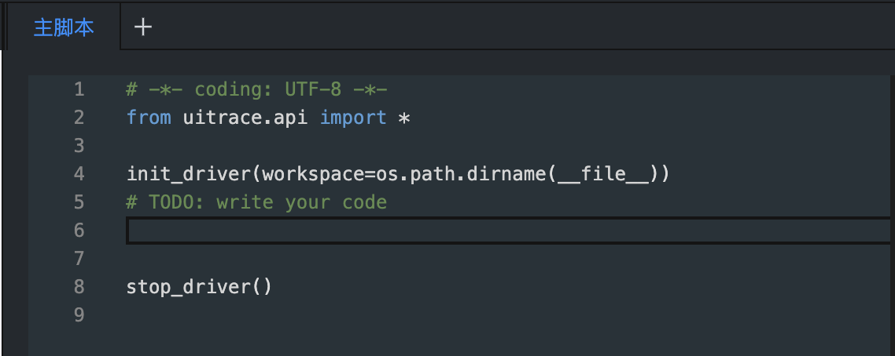
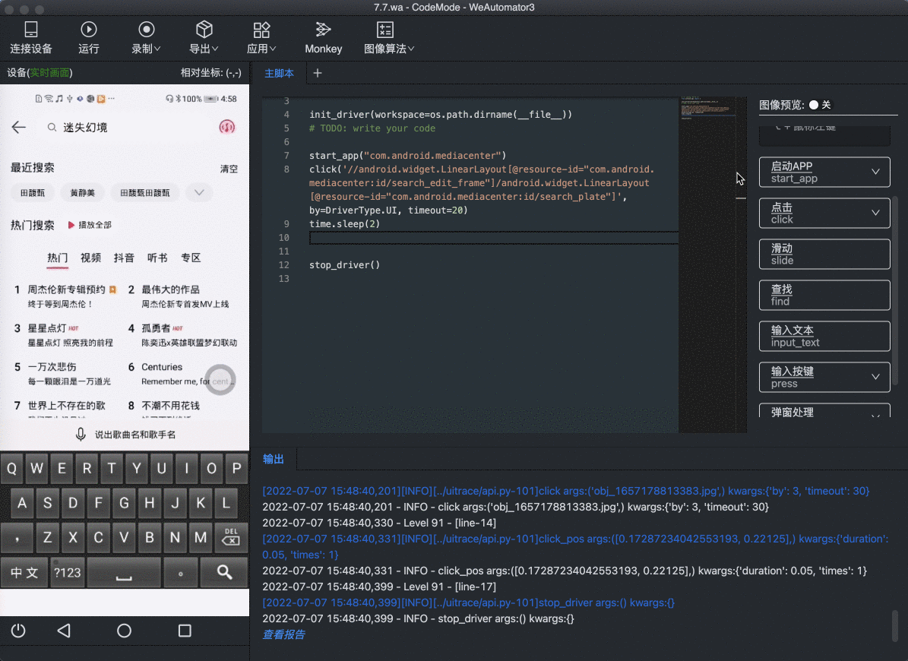
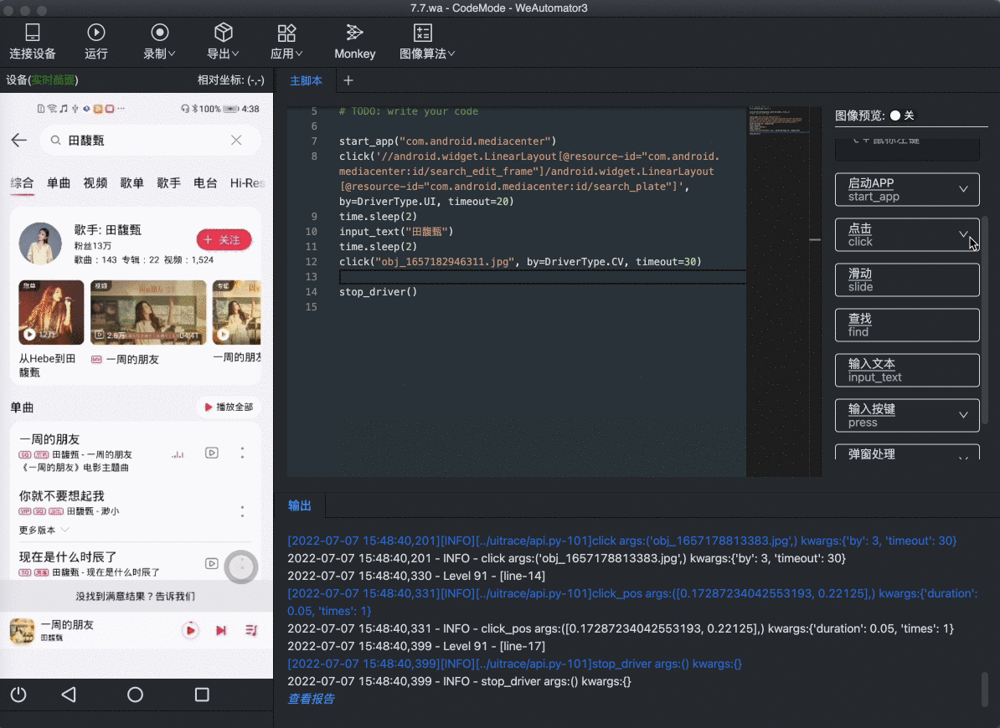
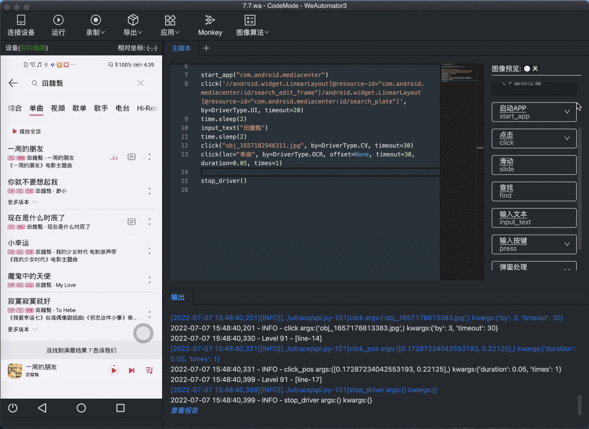
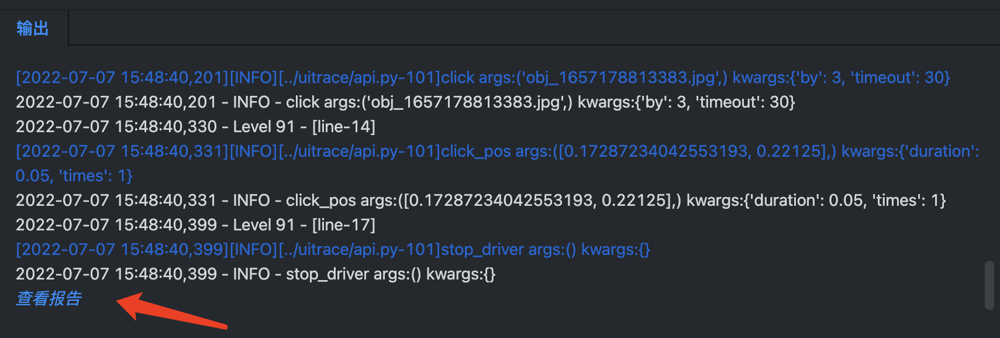
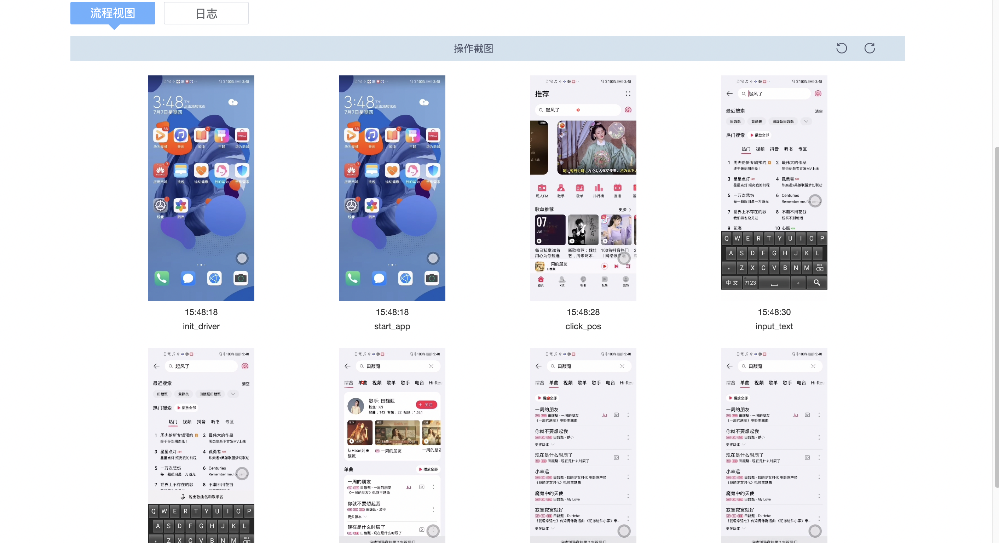
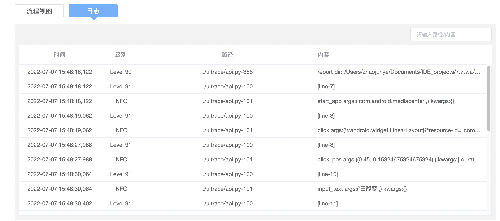

# WeAutomator IDE快速上手

## 1. 介绍
本文档将演示如何使用WeAutomator IDE进行简单的手机自动化测试。强烈建议使用者从这篇文档开始WeAutomator IDE的使用之旅。本示例包含以下内容：
- WeAutomator IDE的简介
- WeAutomator IDE安装
- 如何在WeAutomator IDE中连接设备
- WeAutomator IDE编写和运行简单的测试脚本
- 查看运行报告

## 2. IDE简介

WeAutomator IDE是一款移动端UI自动化工具，支持图像识别、安卓控件识别、录制回放、连接云端手机、智能Monkey等功能，支持游戏和App。              
- WeAutomator提供了简单易用的图像化界面，能够快速录制、生成自动化脚本
- 强大的uitrace功能库，实现Android/iOS的全方位测试
- 基于框架核心库uitrace实现的功能扩展库advance，能实现QQ微信登陆、基于规则或强化学习的monkey、SIFT等点特征匹配算法、边缘匹配等图像算法。
- 提供了Windows、Mac版IDE工具，支持Android、iOS设备，支持脚本形式运行在Linux系统上
## 3. IDE安装
- 外部客户：请联系商务获取安装包
- 内部客户：https://cloudtest.woa.com/console/store/tools/uitrace
## 4. IDE中连接设备
使用WeAutomator IDE对Android进行自动化测试时，首先要连接Android设备。WeAutomator IDE不仅支持连接Android真机，还支持连接WeTest云真机。
连接Android手机前的配置信息请参考 [连接Android设备](../../docs/quick-start/android-connect.md)，本示例默认相关配置已正确设置

### 1）在IDE中连接Android真机
- 使用USB连接Android手机
- 点击IDE中的连接设备

    

- 连接目标设备

    

- 连接成功，IDE成功加载Android手机

    

### 2) 在IDE中连接Android云真机

WeAutomator IDE可以连接WeTest云真机平台的云真机设备。WeTest云真机平台提供流畅无延时的云手机/定制手机，可通过实时日志、截图等功能快速进行问题定位/复现。

外部用户可以访问[WeTest云真机外部站](https://wetest.qq.com/products/cloud-phone)  
内部用户可以访问[WeTest云真机内部站](https://cloudtest.woa.com/introduce/test-lab?from=home)

登陆进入云真机平台后，可以根据自己的需求选择想要测试的设备，本示例以外部站为例

- 选择目标设备，点击**开始调试**，进入设备界面
- 点击**远程调试**，根据当前电脑系统选择调试工具，复制连接命令

    
- 打开电脑命令行，将复制的连接命令粘贴进去，运行
- 通过命令行查看是否连接成功，或者使用`adb devices`查看连接设备

    

    
- 点击IDE中的连接设备
- 连接目标设备
- 连接成功，IDE成功加载Android手机

    

## 5. WeAutomator IDE录制自动化脚本
通过以上过程，我们已经在自己的电脑中安装上对应的IDE，并将需要测试的手机设备和IDE连接，现在我们可以使用IDE录制自动化
测试脚本了。接下来我们将展示一个简单的示例，给使用者展示如何使用WeAutomator录制脚本.

本示例将展示如何使用手机中的音乐软件搜索相关歌手的歌曲并播放
- 连接设备  
通过以上方法完成手机的连接，这时IDE会**主脚本**界面  

  
我们可以在**init_driver**和**stop_driver**之间输入我们的脚本指令

- 启动手机应用

我们点击想要运行的应用，等到应用启动完成，点击IDE右侧的**启动APP**，在跳出的界面上点击**从当前屏幕获取**，IDE会自动识别当前打开的应用名，接着点击**确定**，生成启动应用的指令

- 通过**录制**功能，录制原生控件

通过**录制**->**控件录制**->**原生**，打开IDE控件录制功能，并通过鼠标选择相应的区域，得到点击目标的控件信息，生成通过Xpath点击目标区域的指令

- 输入文本

通过**输入文本**功能，可以模拟向手机输入文本信息。

- 使用OCR文字识别功能，点击目标文字区域

通过使用OCR文字识别功能，可以点击目标文字区域。例如我们点击页面上的“单曲”

- 使用图像匹配算法，点击目标目标图像区域

通过基于cv的图像匹配算法，可以完成对目标图像区域的点击。例如我们通过图像匹配点击页面上的"播放全部"

## WeAutomator IDE运行脚本
接着，我们点击IDE中的**运行**功能，运行上面的脚本，脚本运行过程如下 

## 查看报告
WeAutomator IDE提供了运行报告查看接口，通过点击，可以跳转到运行报告网页。

运行报告

以上就是通过WeAutomator IDE进行简单手机自动化测试的示例。更多IDE使用案例可参考其他的案例。